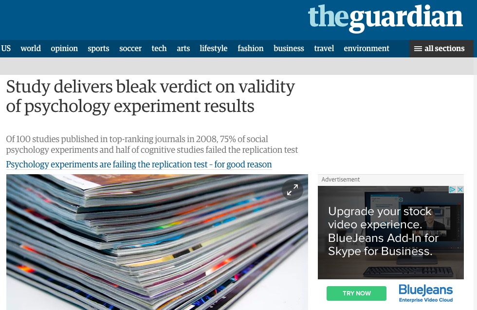
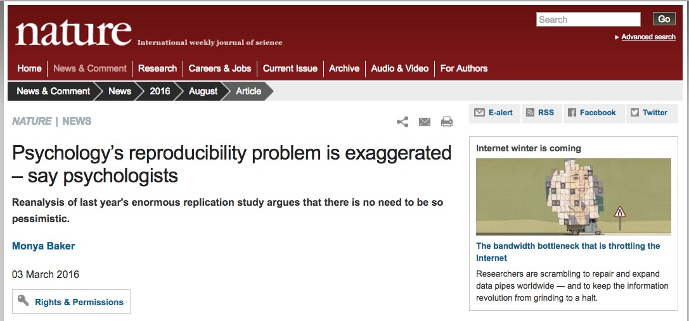
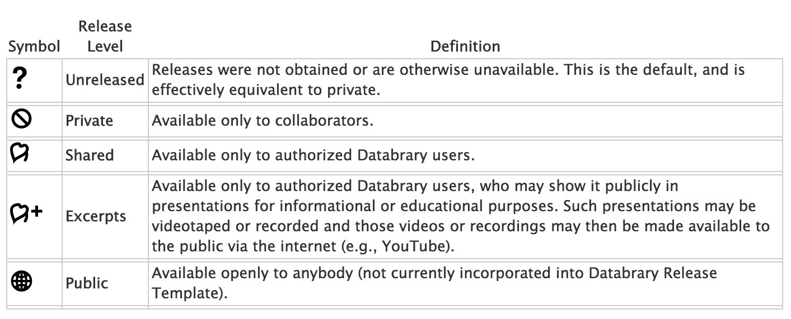
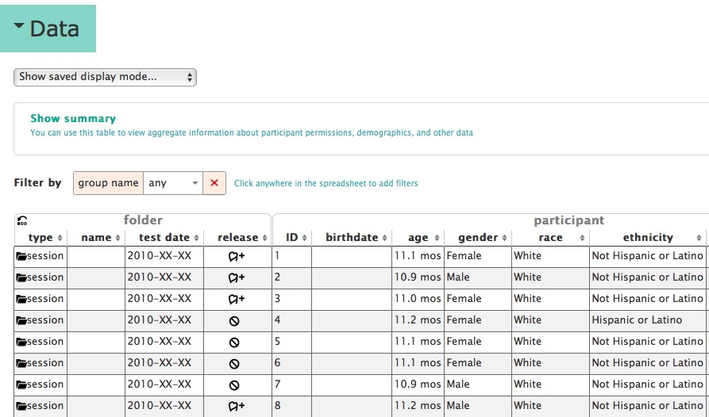
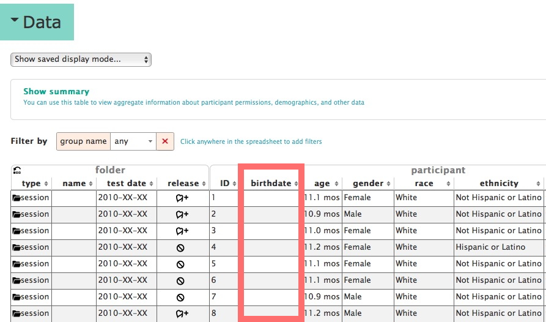
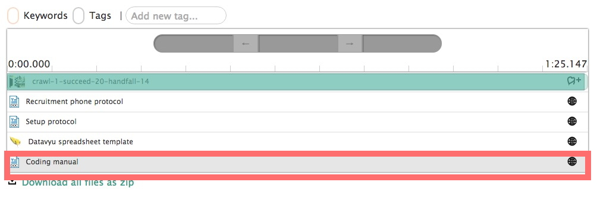
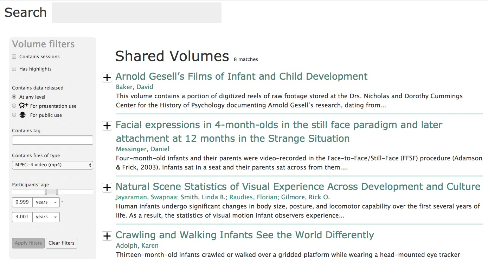

```{r setup, include=FALSE}
knitr::opts_chunk$set(echo = FALSE)
```

## Curating identifiable data with Databrary

<div class="centered">

</div>

## Acknowledgments

- [NSF BCS-1238599](http://www.nsf.gov/awardsearch/showAward?AWD_ID=1238599&HistoricalAwards=false)
- [NICHD U01-HD-076595](https://projectreporter.nih.gov/project_info_description.cfm?aid=8531595&icde=15908155&ddparam=&ddvalue=&ddsub=&cr=1&csb=default&cs=ASC)
- [Society for Research in Child Development (SRCD)](http://srcd.org)
- NYU Libraries, NYU IT, IRB, and OSP

<div class="notes">
- I want to acknowledge support from NSF, NICHD, and the Society for Research in Child Development. 
- I'd also like to thank the NYU Libraries, NYU IT, IRB, and OSP for their advice and support.
- Finally, thank you to the organizers and the sponsors for making this meeting possible.
</div>

## TL; DR

- Psychology is harder than physics
- Video uniquely informative about behavior
- Video is essential for reproducible science of behavior
    + Even where video is *not* the primary raw data
- [Databrary](http://databrary.org) specializes in storing and sharing research video + metadata

<div class="notes">
- It's late on the 2nd day, and you may be tired of hearing people talk to you. So, here's the "too long; didn't read" summary.
</div>

## TL; DR

- Video is identifiable, but it *can* be securely stored, managed, and shared
- **All** ~~behavioral~~ scientists should collect and share videos of their research methods.
- Video (+ other streams) can serve as the core of a multivariate/multi-level big data science of behavior

## Why psychology is harder than physics {.flexbox .vcenter}

<div class="centered">

</div>

## Why psychology is harder than physics {.flexbox .vcenter}

<div class="centered">

</div>

## Video is a uniquely informative source of evidence about behavior

----

<div class="centered">
<a href="http://doi.org/10.1126/science.1093567">

</a>

[[@deloache_scale_2004]](http://doi.org/10.1126/science.1093567)
</div>

<div class="notes">
- If a picture is worth 1,000 words, a video is worth 1,000 pictures.
</div>

----

<div class="centered">
<video width="640" height="480" controls>
  <source src="https://nyu.databrary.org/slot/9850/-/asset/11550/download?inline=true" type="video/mp4">
Your browser does not support the video tag.
</video>
[[@b03c5c6c-31b8-445e-9e4f-8917b735bb53]](http://doi.org/10.17910/B7H019)
</div>

----

<div class="centered">
<video width="640" height="480" controls>
  <source src="https://nyu.databrary.org/slot/11647/0,84928/asset/40653/download?inline=true" type="video/mp4">
Your browser does not support the video tag.
</video>
[[@b155b094-099c-4015-8d05-143257d99f28]](http://doi.org/10.17910/B7.236)
</div>

<div class="notes">
- Here's another example from Chen Yu and Linda Smith.
- It shows the results from two, temporally synched head-mounted eye trackers worn by a mother and her infant while the two play with a set of toys.
- Do infants look at the toys when their mothers direct them to? Do infants look at toys when moms speak?
- Might this form of "joint attention" be a mechanism for language learning?
</div>

----

<div class="centered">
<iframe src="http://pediatrics.aappublications.org/content/early/2016/08/11/peds.2016-1533" width=750px height=500px>
</iframe>

[[@batra_nocturnal_2016]](http://doi.org/10.1542/peds.2016-1533)
</div>

<div class="notes">
- Video data can answer questions of considerable importance to public health.
- Do parents put infants to sleep in postures that are safe or risky?
- These authors got permission to record babies in their cribs to find out, and the answer is surprising -- not as often as they probably should.
- These particular videos aren't shared -- they were collected by my colleagues at Penn State long before we were even thinking about Databrary -- but without video, the question could not really be asked.
</div>

----

<div class="centered">
<video width="640" height="480" controls>
  <source src="https://nyu.databrary.org/slot/11141/0,5000/asset/37958/download?inline=true" type="video/mp4">
Your browser does not support the video tag.
</video>

[[@6243604f-bfd6-488f-b744-50305e9eefaa]](http://doi.org/10.17910/B7G59R)
</div>

<div class="notes">
- Here are videos of a gaze time series for participants from one of three groups of children: typically developing, those with Down Syndrome, and those with autism spectrum disorder.
- See if you can tell which is which.
- This is group 1.
</div>

----

<div class="centered">
<video width="640" height="480" controls>
  <source src="https://nyu.databrary.org/slot/11141/0,5000/asset/37962/download?inline=true" type="video/mp4">
Your browser does not support the video tag.
</video>

[[@6243604f-bfd6-488f-b744-50305e9eefaa]](http://doi.org/10.17910/B7G59R)
</div>

<div class="notes">
- This is group 2.
</div>

----

<div class="centered">
<video width="640" height="480" controls>
  <source src="https://nyu.databrary.org/slot/11141/0,5000/asset/37968/download?inline=true" type="video/mp4">
Your browser does not support the video tag.
</video>

[[@6243604f-bfd6-488f-b744-50305e9eefaa]](http://doi.org/10.17910/B7G59R)
</div>


<div class="notes">
- This is group 3.
- Can you tell which is the typically developing group? It was group 1. Group 2 was the Down syndrome group and 3 was the group with ASD.
- Sometimes video data can show *similarities* even when we might otherwise expect differences.
</div>

## Is behavioral science reproducible?

- Nosek et al. [[@collaboration_estimating_2015]](http://doi.org/10.1126/science.aac4716)
- vs. Gilbert et al. [[@gilbert_comment_2016]](http://doi.org/10.1126/science.aad7243)

<div class="notes">
- Now, I'm certain that many of you are familiar with the recent back and forth about the degree to which psychological science is reproducible.
</div>

----

<div class="centered">
<a href="https://www.theguardian.com/science/2015/aug/27/study-delivers-bleak-verdict-on-validity-of-psychology-experiment-results">

</a>
</div>

----

<div class="centered">
<a href="http://www.nature.com/news/psychology-s-reproducibility-problem-is-exaggerated-say-psychologists-1.19498">

</a>
</div>

## Why the dispute; what to do?

- Behavior rich, complex
- Numeric, text-based measures reduce that complexity

- **Video captures and preserves it**

<div class="notes">
- Why can't we agree?
- One reason is that behavior is rich, multitextured, and complex.
- Our measures often reduce that complexity.
- But **video** can preserve it
- Oftentimes, video tells the story better than words
</div>

----

<div class="centered">
<video width="640" height="480" controls>
  <source src="https://nyu.databrary.org/slot/9840/-/asset/11192/download?inline=true" type="video/mp4">
Your browser does not support the video tag.
</video>
[[@c7fbeef0-d8a9-4b99-9e17-f598507486b7]](http://doi.org/10.17910/B7H019)
</div>

<div class="notes">
- Here's an example from Michael Frank.
- What is this boy doing?
</div>

----

<div class="centered">
<video width="640" height="480" controls>
  <source src="https://nyu.databrary.org/slot/9840/-/asset/11193/download?inline=true" type="video/mp4">
Your browser does not support the video tag.
</video>
[[@c7fbeef0-d8a9-4b99-9e17-f598507486b7]](http://doi.org/10.17910/B7H019)
</div>

<div class="notes">
- What is he doing now?
</div>

----

<iframe src="https://nyu.databrary.org/volume/33" width=640px height=400px>
</iframe>

<div class="notes">
- Now you completely understand the title of this paper -- "Representing exact number visually using mental abacus" -- don't you?
</div>

## Why the dispute; what to do?

- Replications can fail due to methodological differences
- Methods sections can't possibly report all essential details
- **Video captures and preserves it**

<div class="notes>
- Even when researcher try to replicate results with help from the original investigators, the results can fall short?
- Why? Methods sections can't possibly report all essential details due to time and space constraints.
</div>

## Adolph study

<div class="centered">
<video width="640" height="480" controls>
  <source src="https://nyu.databrary.org/slot/9855/0,85147/asset/38977/download?inline=true" type="video/mp4">
Your browser does not support the video tag.
</video>

[[@ddff6ac6-cd1b-4365-89aa-70ea654b4ed9]](http://dx.doi.org/10.17910/B7MW2K)
</div>

<div class="notes">
- Here is a study from Karen Adolph's lab group examining how well infants can perceive when it is safe or risky to cross a bridge.
- This is the raw video. Notice that it consists of multiple camera angles.
- Watch how the experimenters coordinate their actions, keep the baby happy and entertained, adjust the apparatus between trials, and so forth.
</div>

## A reproducible behavioral science *must*...

- Video record all tasks, measures, and behaviors
- Share the recordings openly with other researchers

## *Journal of Visualized Experiments*

<iframe src="http://www.jove.com/" width=750px height=500px>
</iframe>

<div class="notes">
- One solution is to create a journal that publishes video records of scientific protocols. The Journal of Visualized Experiments does just this, and it does it well.
- But, the high production values of JOVE come at equally high cost to researchers and libraries.
</div>

## A reproducible behavioral science must *also*...

- Share all questionnaires, tasks, displays
- Share statistical, computational, data workflows
- Make it easy to share from the beginning
- Seek permission to share data from participants
- Store data securely

----

<iframe src="http://databrary.org" width=640px height=400px>
</iframe>

## [Databrary.org](http://databrary.org)

- Digital data library specialized for research video
- Video/audio + participant/context metadata
- Share displays, materials, text-based data files
- Policy framework for sharing identifiable data
- Developmental focus, but not exclusive

## [Databrary.org](http://databrary.org) facilitates data sharing, re-use, preservation

- High capacity, centralized storage
- Transcoding to common, interoperable formats
- Long-term preservation

## Databrary helps to overcomes barriers to sharing video

- Policies for sharing identifiable video data
- Tools for reproducibly coding video
- Tools for "active curation" == during data collection
- Tools for searching, filtering

## Policies

- Restrict access to authorized researchers (& affiliates)
    + PIs and the trainees they supervise
    + Institutional [access agreement](https://databrary.org/access/policies/agreement.html)
- Seek permission to share data from participants
    + Release [template](https://databrary.org/access/policies/release-template.html); [script](https://databrary.org/access/guide/investigators/release/asking/script.html); sample [video](https://databrary.org/video/example-video-1.mp4)

## Standardized (reproducible) release levels

<div class="centered">
<a href="https://databrary.org/access/guide/investigators/release/release-levels.html">

</a>
</div>

## Tools for coding video

- Raw research video must be coded by human observers
- [Datavyu](http://datavyu.org) a free, [open source](https://github.com/databrary/datavyu) coding tool
- Add codes, annotations time-locked to video segments
- Turn behavior into quantifiable data
- Ruby API for [scripting](https://github.com/databrary/Datavyu-Example-Scripts) reproducible workflows

----

<div class="centered">
<a href="http://datavyu.org/user-guide/index.html">

</a>
</div>

---- 

<div class="centered">
<video width="700" height="550" controls>
  <source src="https://nyu.databrary.org/slot/11652/307774,376273/asset/47075/download?inline=true" type="video/mp4">
Your browser does not support the video tag.
</video>
</div>
</iframe>

<div class="notes">
- Here's an example of a short segment of video that has been coded for a some behaviors of interest -- speech, actions involving objects, and locomotion.
- Notice how the annotations, coupled to the video segments, reveals the complex interrelationships among behaviors.
- And, we've only focused on a subset of them.
</div>

## Tools for curating data **as it is collected**

- After-the-fact curation burdensome
- Databrary organizes, shares, standardized participant metadata
- Sharing based on
    + user access level
    + participant permission
    
<div class="notes">
- Behavioral researchers spend hours coding videos, and so spending even more time after the fact to curate it for sharing with others is hugely burdensome.
- So, Databrary tries to make it easy and convenient for researchers to curate their data while it is collected.
</div>
    
## Databrary's structure

- Datasets have own page; shared datasets have DOIs.
- Data about testing *sessions* (locations, dates/times, people) stored in *spreadsheet*
- Session data organized in *timeline*
- Store data AND materials (displays, protocols, etc.)

## [[@ddff6ac6-cd1b-4365-89aa-70ea654b4ed9]](http://dx.doi.org/10.17910/B7MW2K)

<iframe src="https://nyu.databrary.org/volume/5" width=750px height=500px>
</iframe>

<div class="notes"
- Here is an illustrative dataset.
- Datasets have own page; shared datasets have DOIs.
- Datsets can have *highlights* audio, video, or photos that represent the main points of a study.
- Data about testing *sessions* (locations, dates/times, people) stored in *spreadsheet*
- Session data organized in *timeline*
- Store data AND materials (displays, protocols, etc.)
</div>
----

<div class="centered">

</div>

----

<div class="centered">

</div>

----

<div class="centered">

</div>

----

<div class="centered">

</div>

----

<div class="centered">

</div>

----

<div class="centered">


[[@ddff6ac6-cd1b-4365-89aa-70ea654b4ed9]](http://dx.doi.org/10.17910/B7MW2K)
</div>

----

<div class="centered">
<iframe src="https://nyu.databrary.org/volume/81/slot/7580/-?asset=15968" width=750px height=500px>
</iframe>

[[@264e9563-8bc9-4863-b70f-e92203c3f283]](http://doi.org/10.17910/B7988V)
</div>

<div class="notes">
- Here's an example of a session from one of my own shared datasets.
- It represents a set of videos collected from head-mounted cameras worn by infants in India.
- Notice that there are many video segments, and Databrary represents the temporal relationships among them.
</div>

## Tools for searching, filtering by participant characteristics

<div class="centered">

</div>

<div class="notes">
- It's all well and good to put data into a repository, but how do we get it out?
- It's been clear for some time that searching and filtering have revolutionized the way we access knowledge in almost every domain.
- I suggest that the same will be true in data science.
- At the moment, Databrary offers the ability to search for datasets based on participant or file characteristics.
- But, this search capability will surely grow, and so in the very near future, a researcher will be able to search for individual sessions or even segments of time when a particular event is occurring.
</div>

----

<iframe width="560" height="315" src="https://www.youtube.com/embed/ZAmZucyzyZM" frameborder="0" allowfullscreen></iframe>

## "Big" questions about behavior require big(ger) data

<div class="centered">

</div>

## "Big" questions about behavior require big(ger) data

- Multiple levels of spatial, temporal resolution
- Linked data sets and streams
- Key linkage variables: *when* (time), *where* (location), *who* (age, gender)
- Video is a spatially and temporally rich time series

<div class="notes">
- Video is just one of a number of spatially and temporally rich time series that scientists collect about human behavior.
- Going forward, we need to build infrastructure that allows data repositories to capture and researchers to visualize and analyze multivariate time series.
</div>

## How data scientists can help...

- Semi-automated video annotation
- Speech stream extraction from natural video, transcription, ms-level precision
- Multivariate time series visualization, data reduction, analysis
- Linking data, while preserving privacy

## Take homes

- Video uniquely captures complexity & richness of behavior
- Video captures vital methodological details
- Identifiable video (and other data) can be shared securely and ethically
- Preparing to share reduces the burden

## Take homes

- Video data sharing essential for a reproducible, robust behavioral science
- Video can serve as the core of a big data revolution in behavioral science

----

<iframe src="http://wires.wiley.com/WileyCDA/WiresArticle/articles.html?doi=10.1002%2Fwcs.1379" width=640px height=400px>
</iframe>

----

<iframe src="http://databrary.org" width=640px height=400px>
</iframe>

----

<div class="centered">

</div>

----

<iframe src="https://github.com/databrary/presentations/tree/master/nysds-2016" width=640px height=400px>
</iframe>

## References {.smaller}

