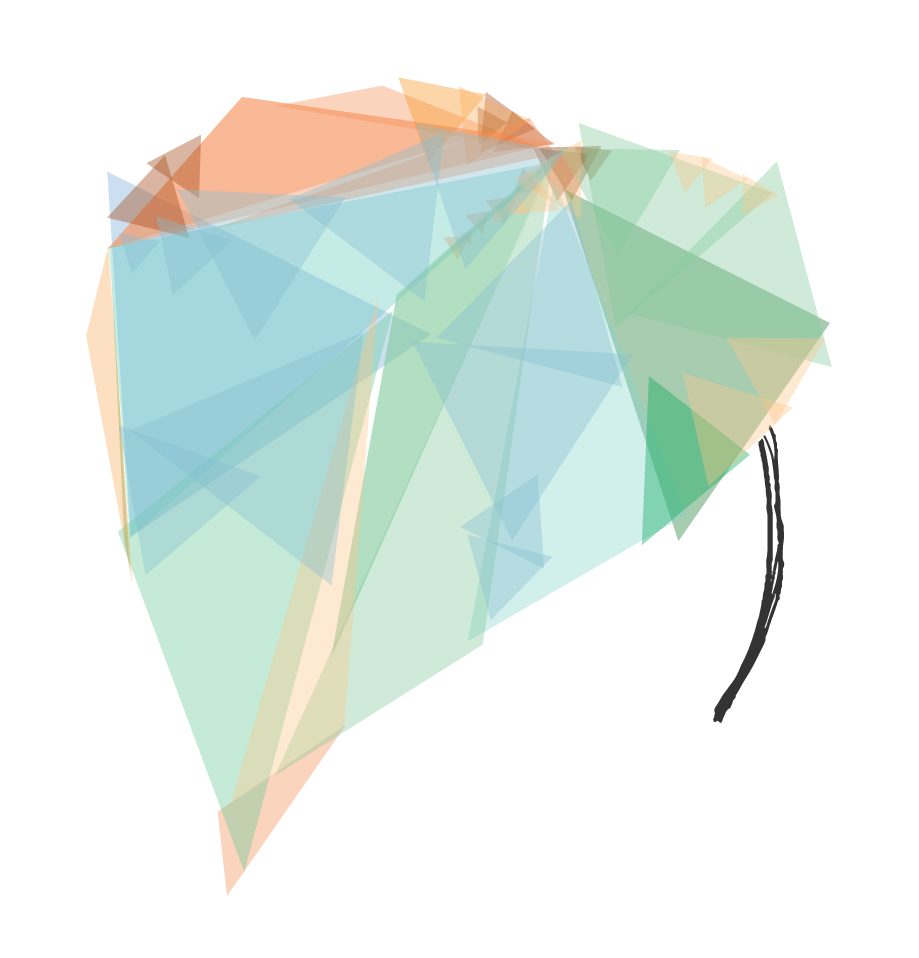
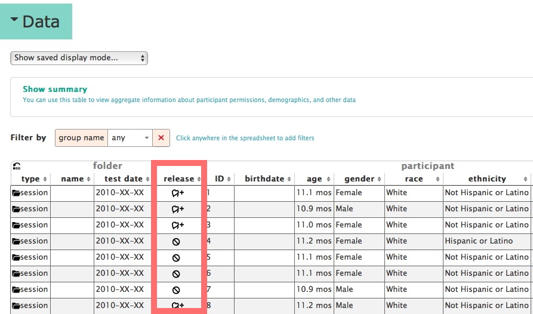
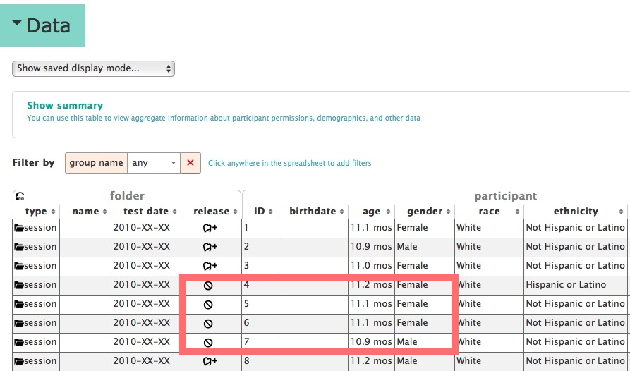
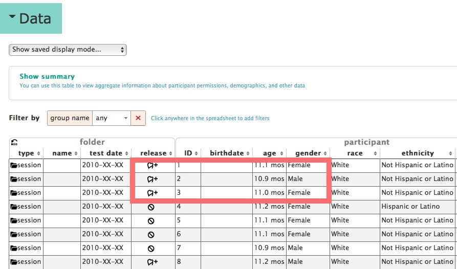

```{r setup, include=FALSE}
knitr::opts_chunk$set(echo = FALSE)
```

## Curating identifiable data with Databrary

<div class="centered">

</div>

## Acknowledgments

- [NSF BCS-1238599](http://www.nsf.gov/awardsearch/showAward?AWD_ID=1238599&HistoricalAwards=false)
- [NICHD U01-HD-076595](https://projectreporter.nih.gov/project_info_description.cfm?aid=8531595&icde=15908155&ddparam=&ddvalue=&ddsub=&cr=1&csb=default&cs=ASC)
- [Society for Research in Child Development (SRCD)](http://srcd.org)
- NYU Libraries, NYU IT, IRB, and OSP

## TL; DR

- Video is essential for reproducible behavioral science
    + Even where video is *not* the primary raw data
- [Databrary](http://databrary.org) specializes in storing and sharing research video
- Video is identifiable, but it *can* be securely stored, managed, and shared
- **All** behavioral scientists should collect and share videos of their research

## Is behavioral science reproducible?

- Nosek et al. [[@collaboration_estimating_2015]](http://doi.org/10.1126/science.aac4716)
- vs. Gilbert et al. [[@gilbert_comment_2016]](http://doi.org/10.1126/science.aad7243)

## Why we're unsure

- Behavior rich, complex
- Numeric, text-based measures reduce that complexity
- **Video captures and preserves it**

----

<div class="centered">
<video width="640" height="480" controls>
  <source src="https://nyu.databrary.org/slot/9840/-/asset/11192/download?inline=true" type="video/mp4">
Your browser does not support the video tag.
</video>
[[@c7fbeef0-d8a9-4b99-9e17-f598507486b7]](http://doi.org/10.17910/B7H019)
</div>

----

<div class="centered">
<video width="640" height="480" controls>
  <source src="https://nyu.databrary.org/slot/9840/-/asset/11193/download?inline=true" type="video/mp4">
Your browser does not support the video tag.
</video>
[[@c7fbeef0-d8a9-4b99-9e17-f598507486b7]](http://doi.org/10.17910/B7H019)
</div>

## Why we're unsure

- Replications can fail due to methodological differences
- Methods sections can't possibly report essential details
- **Video captures and preserves it**

----

<div class="centered">
<video width="640" height="480" controls>
  <source src="https://nyu.databrary.org/slot/9855/0,85147/asset/38977/download?inline=true" type="video/mp4">
Your browser does not support the video tag.
</video>

[[@ddff6ac6-cd1b-4365-89aa-70ea654b4ed9]](http://dx.doi.org/10.17910/B7MW2K)
</div>

## A reproducible behavioral science *must*...

>- Video record all tasks, measures, and behaviors
>- Share the recordings openly with other researchers

## *Journal of Visualized Experiments*

<iframe src="http://www.jove.com/" width=750px height=500px>
</iframe>

## But, a reproducible behavioral science must *also*...

>- Share all questionnaires, tasks, displays
>- Share statistical, computational, data workflows
>- Prepare to share from the beginning
>- Seek permission to share data from participants

## [Databrary.org](http://databrary.org)

- Digital data library specialized for research video
- Video/audio + participant/context metadata
- Share displays, materials, text-based data files

## [Databrary.org](http://databrary.org) makes this possible

- Restricted access for research/educational use
- Policy framework for sharing identifiable data
- Developmental focus, but not exclusive

## [Databrary.org](http://databrary.org) makes this possible

- High capacity, centralized storage
- Transcoding to common, interoperable formats
- Long-term preservation

## Databrary's progress

- Support from NSF and NICHD in late 2012, early 2013.
- Website "live" early 2014.
- Rapid growth in investigators, institutions, datasets.

----

<iframe src="https://databrary.org" width=750px height=500px>
</iframe>

## How Databrary overcomes barriers to sharing video

- Policies for sharing identifiable video data
- Tools for reproducibly coding video
- Tools for "active curation" == during data collection
- Tools for searching, filtering

## Policies

- Restrict access to authorized researchers (& affiliates)
    + Institutional [access agreement](https://databrary.org/access/policies/agreement.html)
- Seek permission to share data from participants
    + Release [template](https://databrary.org/access/policies/release-template.html); [script](https://databrary.org/access/guide/investigators/release/asking/script.html); sample [video](https://databrary.org/video/example-video-1.mp4)

## Standardized release levels

<div class="centered">
<a href="https://databrary.org/access/guide/investigators/release/release-levels.html">

</a>
</div>

## Tools for coding video

- Raw research video must be coded
- [Datavyu](http://datavyu.org) a free, [open source](https://github.com/databrary/datavyu) coding tool
- Add codes, annotations time-locked to video segments
- Turn behavior into quantifiable data
- Ruby API for [scripting](https://github.com/databrary/Datavyu-Example-Scripts) reproducible workflows

----

<div class="centered">
<a href="http://datavyu.org/user-guide/index.html">

</a>
</div>

---- 

<div class="centered">
<video width="700" height="550" controls>
  <source src="https://nyu.databrary.org/slot/11652/307774,376273/asset/47075/download?inline=true" type="video/mp4">
Your browser does not support the video tag.
</video>
</div>
</iframe>

## Video is just a spatially and temporally rich time series

<div class="centered">
<a href="http://www.psyrecon.de/uploads/pics/psychophysiologischeVariablen_01.jpg">

</a>
</div>

----

<div class="centered">
<video width="640" height="480" controls>
  <source src="https://nyu.databrary.org/slot/11141/0,5000/asset/37958/download?inline=true" type="video/mp4">
Your browser does not support the video tag.
</video>
</div>
</iframe>

----

<div class="centered">
<video width="640" height="480" controls>
  <source src="https://nyu.databrary.org/slot/11141/0,5000/asset/37962/download?inline=true" type="video/mp4">
Your browser does not support the video tag.
</video>
</div>
</iframe>

----

<div class="centered">
<video width="640" height="480" controls>
  <source src="https://nyu.databrary.org/slot/11141/0,5000/asset/37968/download?inline=true" type="video/mp4">
Your browser does not support the video tag.
</video>
</div>
</iframe>

## Datavyu can import multiple time series

- Heart rate, skin conductance, brain activation
- Eye position, diameter
- Body position, movement
- Coming soon: Visualizing Datavyu tags within Databrary

## Curating data **as it is collected**

- After-the-fact curation burdensome
- Databrary organizes, shares, standardized participant metadata
- Sharing based on
    + user access level
    + participant permission
    
## Databrary's structure

- Datasets have own page; shared datasets have DOIs.
- Data about testing *sessions* (locations, dates/times, people) stored in *spreadsheet*
- Session data organized in *timeline*
- Store data AND materials (displays, protocols, etc.)

## [[@ddff6ac6-cd1b-4365-89aa-70ea654b4ed9]](http://dx.doi.org/10.17910/B7MW2K)

<iframe src="https://nyu.databrary.org/volume/5" width=750px height=500px>
</iframe>

----

<div class="centered">

</div>

----

<div class="centered">

</div>

----

<div class="centered">

</div>

----

<div class="centered">

</div>

----

<div class="centered">

</div>

----

<div class="centered">


[[@ddff6ac6-cd1b-4365-89aa-70ea654b4ed9]](http://dx.doi.org/10.17910/B7MW2K)
</div>

## Searching, filtering by participant characteristics

<div class="centered">

</div>

## Take homes

- Video uniquely captures complexity & richness of behavior
- Video captures vital methodological details
- Identifiable video (and other data) can be shared securely and ethically
- Preparing to share reduces the burden
- Video data sharing essential for a reproducible science

----

<iframe src="http://databrary.org" width=640px height=400px>
</iframe>

----

<iframe src="https://databrary.org/about/jobs.html" width=640px height=400px>
</iframe>

----

<div class="centered">


<http://github.com/databrary/presentations/nysds-2016/>
</div>

## References {.smaller}

