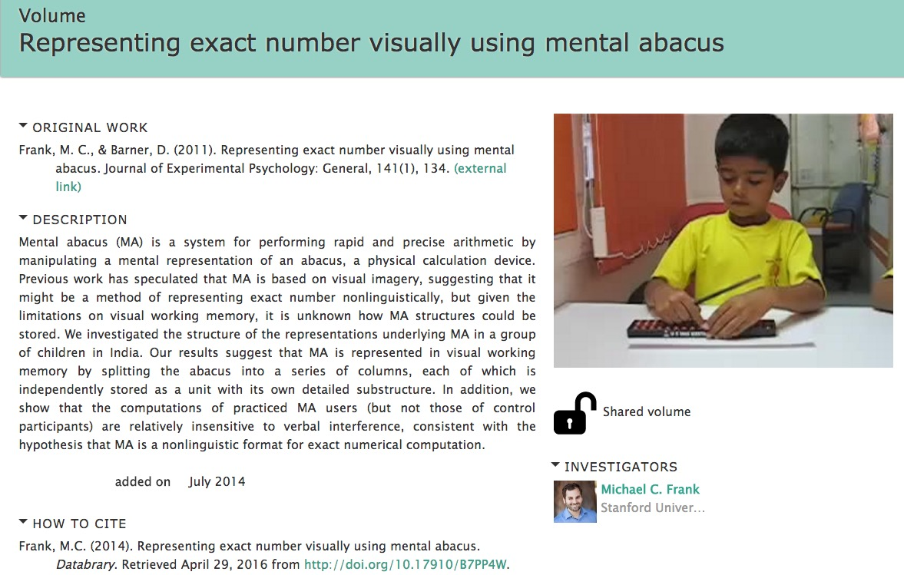
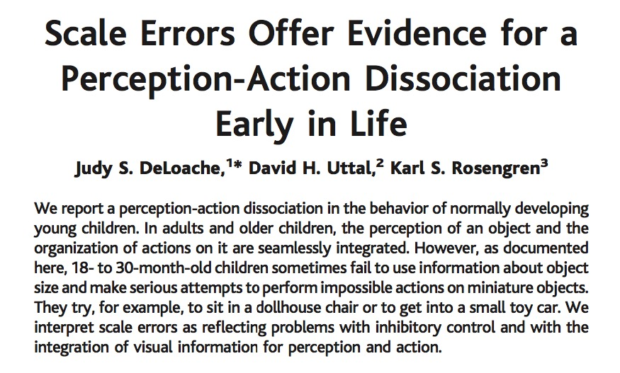

```{r setup, include=FALSE}
knitr::opts_chunk$set(echo = FALSE)
```

## “Video Doesn’t Lie"

<div class=centered>
**Reproducible Workflows With [Databrary](http://databrary.org)**

Karen E. Adolph (NYU)</br>
David Millman (NYU)</br>
Rick O. Gilmore (Penn State)</br>

<http://github.com/databrary/presentations/nyu-data-science-reproducibility-16/video-reproducibility>
</div>

## Acknowledgements

- [NSF BCS-1238599](http://www.nsf.gov/awardsearch/showAward?AWD_ID=1238599&HistoricalAwards=false)
- [NICHD U01-HD-076595](https://projectreporter.nih.gov/project_info_description.cfm?aid=8531595&icde=15908155&ddparam=&ddvalue=&ddsub=&cr=1&csb=default&cs=ASC)
- [Society for Research in Child Development (SRCD)](http;//srcd.org)

## Is Psychological Science Reproducible?

<div class="centered">
<a href="http://cos.io">

</div>
</a>

- Nosek et al., [[@collaboration_estimating_2015]](http://doi.org/10.1126/science.aac4716)
- vs. Gilbert et al. [[@gilbert_comment_2016]](http://doi.org/10.1126/science.aad7243)
- Sharing [data](https://osf.io/ezcuj/wiki/home/?_ga=1.260625677.1251838540.1458403228) focuses attention on substantive issues

## Video Uniquely Captures Behavior

<div class="centered">
<video width="640" height="480" controls>
  <source src="https://nyu.databrary.org/slot/9840/-/asset/11193/download?inline=true" type="video/mp4">
Your browser does not support the video tag.
</video>
[[@c7fbeef0-d8a9-4b99-9e17-f598507486b7]](http://doi.org/10.17910/B7H019)
</div>

https://nyu.databrary.org/slot/9840/-/asset/11193/download?inline=true

## [[@c7fbeef0-d8a9-4b99-9e17-f598507486b7]](http://doi.org/10.17910/B7H019)

<div class=centered>
<a href="https://nyu.databrary.org/volume/33">

</a>
</div>

## Video Collection & Sharing Aids Reproducibility

- Methodological details not captured in write-ups
- Unequivocally & unambiguously demonstrates phenomenon

## Children's Scale Errors

<div class="centered">
<a href="http://doi.org/10.1126/science.1093567">

</a>

[[@deloache_scale_2004]](http://doi.org/10.1126/science.1093567)
</div>

## Children's Scale Errors {.vcenter}

<div class="centered">
<video width="640" height="480" controls>
  <source src="https://nyu.databrary.org/slot/9850/-/asset/11552/download?inline=true" type="video/mp4">
Your browser does not support the video tag.
</video>
[[@b03c5c6c-31b8-445e-9e4f-8917b735bb53]](http://doi.org/10.17910/B7H019)
</div>

## [Databrary.org](http://databrary.org)

- Digital data library specialized for video
- Video/audio + participant/context metadata
- Restricted access for research/educational use

## Databrary Improves Reproducibility

- "Active" curation of data *as it's collected*
- Organize, share, standardize participant metadata
- Share materials, displays

## Databrary Improves Reproducibility

- External links to code repos
- DOIs for shared datasets
- Long-term preservation via partnership with NYU Libraries

## Scripting Video Data Analyses

- Most analyses of video use specialized tools
- [Datavyu.org](http://datavyu.org)
- Free, open source, <https://github.com/databrary/datavyu>
- Java with Ruby API for [scripting](https://github.com/databrary/Datavyu-Example-Scripts)

## Datavyu Script Example 1

- Checking/correcting errors

## Take Homes

- Video captures behavior
- Databrary securely stores, shares video
- Video + Databrary -> reproducible & transparent workflows
- Video + Datavyu -> reproducible & transparent workflows
- Databrary helps make psychological science more transparent & reproducible

## References {.smaller}
