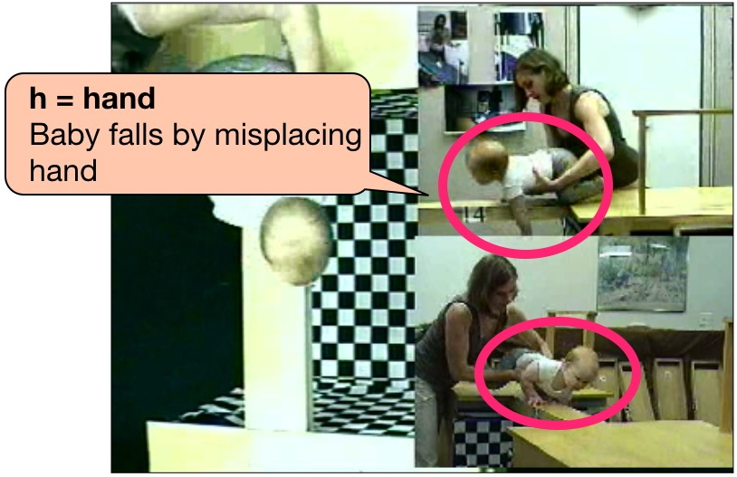
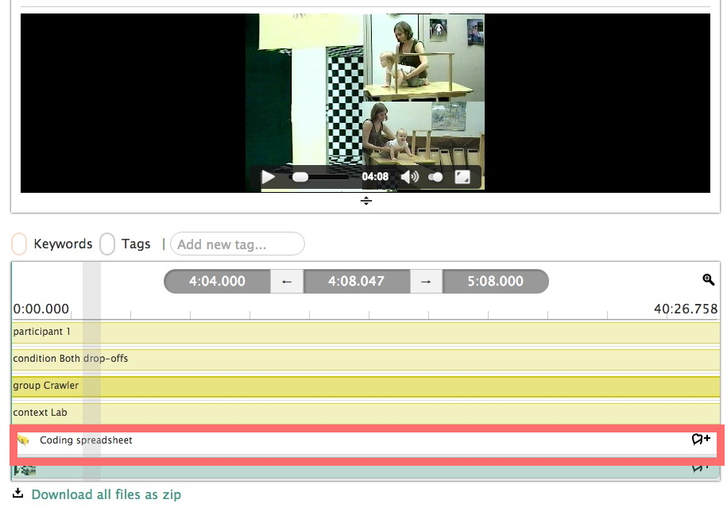
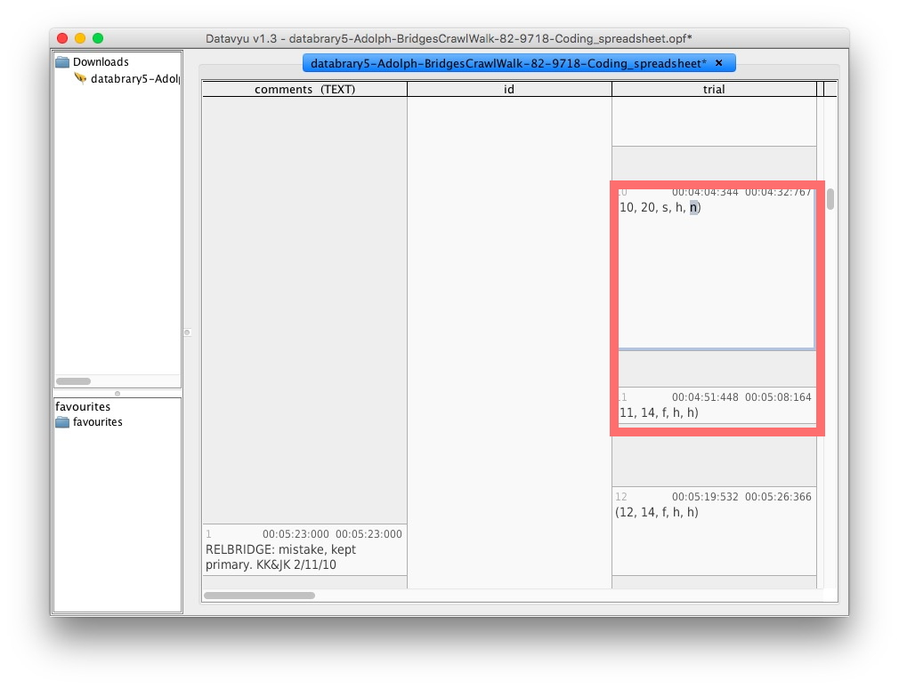
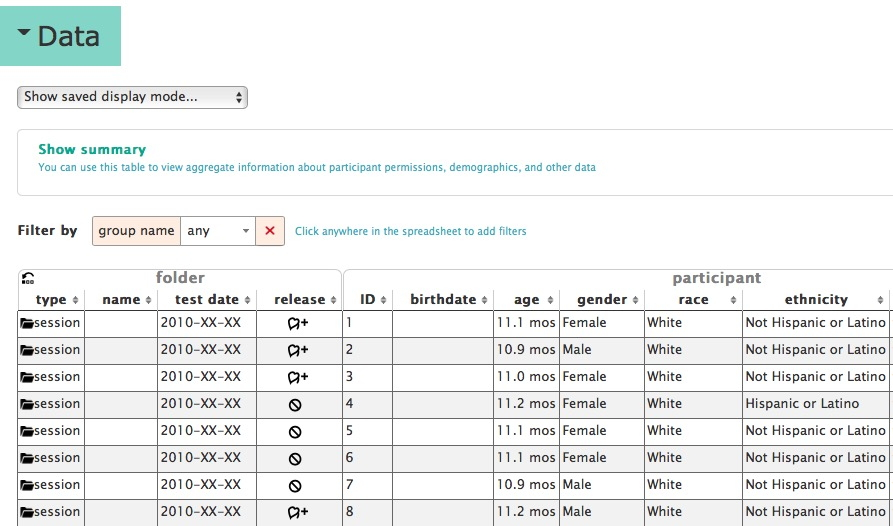
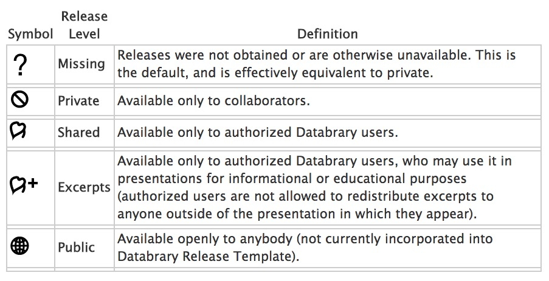

```{r setup, include=FALSE}
knitr::opts_chunk$set(echo = FALSE)
```

## Acknowledgments

- [NSF BCS-1238599](http://www.nsf.gov/awardsearch/showAward?AWD_ID=1238599&HistoricalAwards=false)
- [NICHD U01-HD-076595](https://projectreporter.nih.gov/project_info_description.cfm?aid=8531595&icde=15908155&ddparam=&ddvalue=&ddsub=&cr=1&csb=default&cs=ASC)
- [Society for Research in Child Development (SRCD)](http://srcd.org)
- NYU Libraries, NYU IT, IRB, and OSP

## Is psychological science reproducible?
<div class="centered">
<a href="http://cos.io">

</div>
</a>

- Nosek et al. [[@collaboration_estimating_2015]](http://doi.org/10.1126/science.aac4716)
- vs. Gilbert et al. [[@gilbert_comment_2016]](http://doi.org/10.1126/science.aad7243)
- Sharing [data](https://osf.io/ezcuj/wiki/home/?_ga=1.260625677.1251838540.1458403228) focuses attention on substantive issues

----
<iframe src="http://databrary.org" width=640px height=400px>
</iframe>

## [Databrary.org](http://databrary.org)
- Digital data library specialized for research video
- Video/audio + participant/context metadata
- Restricted access for research/educational use
- Policy framework for sharing identifiable data

## Video uniquely captures behavior
<div class="centered">
<video width="640" height="480" controls>
  <source src="https://nyu.databrary.org/slot/9840/-/asset/11192/download?inline=true" type="video/mp4">
Your browser does not support the video tag.
</video>
[[@c7fbeef0-d8a9-4b99-9e17-f598507486b7]](http://doi.org/10.17910/B7H019)
</div>

## Video uniquely captures behavior
<div class="centered">
<video width="640" height="480" controls>
  <source src="https://nyu.databrary.org/slot/9840/-/asset/11193/download?inline=true" type="video/mp4">
Your browser does not support the video tag.
</video>
[[@c7fbeef0-d8a9-4b99-9e17-f598507486b7]](http://doi.org/10.17910/B7H019)
</div>

https://nyu.databrary.org/slot/9840/-/asset/11193/download?inline=true

## [[@c7fbeef0-d8a9-4b99-9e17-f598507486b7]](http://doi.org/10.17910/B7H019)
<div class=centered>
<a href="https://nyu.databrary.org/volume/33">

</a>
</div>

## Unequivocally & unambiguously demonstrates phenomena
<div class="centered">
<a href="http://doi.org/10.1126/science.1093567">

</a>

[[@deloache_scale_2004]](http://doi.org/10.1126/science.1093567)
</div>

----
<div class="centered">
<video width="640" height="480" controls>
  <source src="https://nyu.databrary.org/slot/9850/-/asset/11550/download?inline=true" type="video/mp4">
Your browser does not support the video tag.
</video>
[[@b03c5c6c-31b8-445e-9e4f-8917b735bb53]](http://doi.org/10.17910/B7H019)
</div>

----

<iframe src="http://doi.org/10.17910/B7H019" width=640px height=400px>
</iframe>

## Video depicts unreported methodological details [[@ddff6ac6-cd1b-4365-89aa-70ea654b4ed9]](http://dx.doi.org/10.17910/B7MW2K)
<div class="centered">
<video width="640" height="480" controls>
  <source src="https://nyu.databrary.org/slot/9855/0,85147/asset/38977/download?inline=true" type="video/mp4">
Your browser does not support the video tag.
</video>
</div>

## [Datavyu](http://datavyu.org) makes video coding reproducible

- Raw research video must be coded
- [Datavyu.org](http://datavyu.org) = free, [open source](https://github.com/databrary/datavyu) coding tool
- Add codes, annotations time-locked to video segments
- Ruby API for [scripting](https://github.com/databrary/Datavyu-Example-Scripts) reproducible workflows

----

<div class="centered">
<a href="http://datavyu.org/user-guide/index.html">

</a>
</div>

## Datavyu facilitates reproducible video coding

<div class="centered">


[[@ddff6ac6-cd1b-4365-89aa-70ea654b4ed9]](http://dx.doi.org/10.17910/B7MW2K)
</div>

----

<div class="centered">

</div>

----

<div class="centered">

</div>

----

<div class="centered">

</div>

----

<div class="centered">


[[@ddff6ac6-cd1b-4365-89aa-70ea654b4ed9]](http://dx.doi.org/10.17910/B7MW2K)
</div>

## Databrary enhances reproducibility

- "Active" curation of data **as it is collected**
- Organize, share, standardized participant metadata
- Sharing based on 
    + user access level
    + participant permission

## [[@ddff6ac6-cd1b-4365-89aa-70ea654b4ed9]](http://dx.doi.org/10.17910/B7MW2K)
<iframe src="https://nyu.databrary.org/volume/5" width=750px height=500px>
</iframe>

----

<div class="centered">

</div>

----

<div class="centered">

</div>

----

<div class="centered">

</div>

----

<div class="centered">

</div>

----

<div class="centered">

</div>

## Standardized -- reproducible -- release levels

<a href="https://databrary.org/access/guide/investigators/release/release-levels.html">
<div class="centered">

</a>
</div>

## Databrary enhances reproducibility

> - Share raw research videos
> - Share video excerpts for teaching and learning
> - Share materials, coding spreadsheets, displays
> - Share links to papers, code repositories
> - Shared datasets get DOIs
> - Long-term preservation via partnership with NYU Libraries

## Take homes

- Video uniquely captures complexity & richness of behavior
- Databrary securely stores, shares video + metadata
- Databrary and Datavyu enhance reproducibility of video-based research
- Databrary makes psychological science more transparent & reproducible
- <http://github.com/databrary/presentations/nyu-data-science-reproducibility-16>

## To boldly go where no science has gone before...

- Reproducibility of numerical computation ≠ 
- Reproducibility of behavioral measures, manipulations
- **All** behavioral researchers should 
    + share reproducible workflows of data, analyses *AND*
    + videos of behavioral measures, displays
    
## Join us!

<iframe src="https://databrary.org/about/jobs.html" width=640px height=400px>
</iframe>

## References {.smaller}
