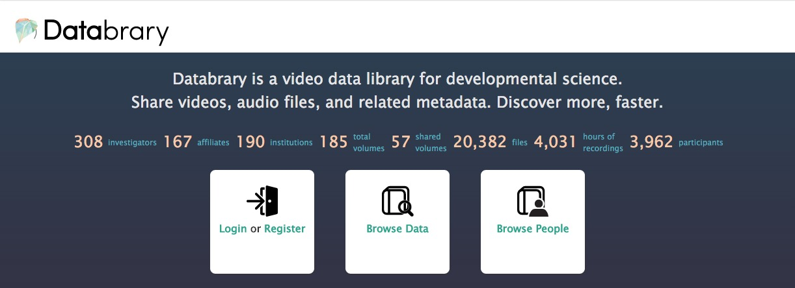

## Sharing video data @ PSU

- Why data sharing?
- What is Databrary?
- Databrary access model
- PSU-specific issues

## Why data sharing?

- Funder mandates
    + [NIMH](http://grants.nih.gov/grants/guide/notice-files/NOT-MH-15-012.html)
    + *"Investigators are expected to share with other researchers, at no more than incremental cost and within a reasonable time, the primary data, samples, physical collections and other supporting materials created or gathered in the course of work under NSF grants."* [NSF Data Sharing Policy](https://www.nsf.gov/bfa/dias/policy/dmp.jsp)

## Why data sharing?

- Accelerates discovery
- Increases transparency, reproducibility
- Increases benefits of participation in research

## What is [Databrary](http://databrary.org)?

- Digital data library specialized for storing, managing, & sharing video
- Supported by [NICHD U01-HD-076595-01](https://projectreporter.nih.gov/project_info_description.cfm?aid=8531595&icde=15908155&ddparam=&ddvalue=&ddsub=&cr=1&csb=default&cs=ASC) and [NSF BCS-1238599](http://www.nsf.gov/awardsearch/showAward?AWD_ID=1238599&HistoricalAwards=false)
- Policies for sharing identifiable video a specific aim

## Databrary access model

- Goals
    + Encourage re-use, accelerate discovery
    + Protect participants
    + Protect data contributors
    
## Hurdles

- Video contains faces, voices, names spoken out loud, images of homes
- Blurring expensive, undermines value of reuse
- Images personally identifying information (PII) under [HIPAA](http://www.hhs.gov/hipaa/for-professionals/privacy/special-topics/de-identification/index.html)

## Approach

- Restrict access to authorized researchers
- Seek permission to share
- Release levels reflect disclosure risk

## Limit access to researchers with institutional authorization

- [Databrary Access Agreement](https://databrary.org/access/policies/agreement.html) (NYU <-> PSU)
- Legal agreement; @ PSU OSP signs
- Authorized investigators must be PIs; can approve affiliates
- [User guide](https://databrary.org/access/guide.html)
- [Institution guide](https://databrary.org/access/guide/institutions.html)

## Access agreement permits

- Non-/pre-research uses
- Research use with IRB approval
- Contributions with IRB approval

## Seek permission to share

- Build on informed consent, video/photo release practices
- Less ambiguous than checklists
- [Databrary template](https://databrary.org/access/policies/release-template.html)
- Sample [script](https://databrary.org/access/guide/investigators/release/asking/script.html) and [video](https://databrary.org/access/guide/investigators/release/asking/examples.html)

## Seeking permission to share

- Separate release for sharing from consent to participate
    + Recommend asking after
- Ask sharing permission within consent document
- Separate protocol for sharing
    
## Release levels reflect disclosure risk

- No sharing, data remains within IRB-approved team
    + Unreleased (didn't ask; info lost)
    + Private (refused)
- Sharing outside IRB-approved protocol
    + Authorized users
    + Excerpts
    + Public

## Databrary to-date

## PSU Issues

- How to ask, document permission to share
- Compromising ability to share by making future data uses too specific
- Data destruction requirements incompatible with data archiving
- Where can video data be stored
- Can ["old" data be shared](https://databrary.org/access/guide/investigators/release/grandfathering-data.html) if consent == Databrary release

## PSU Issues

- How identifiable are video data without [other identifiers](http://www.hhs.gov/ohrp/policy/cdebiol.html)?
- Who owns research data?